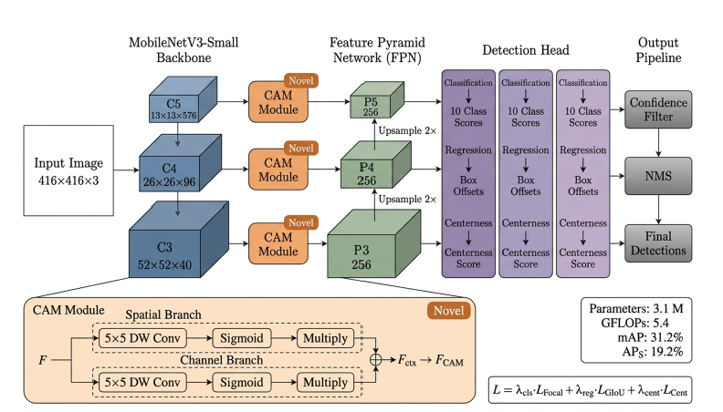
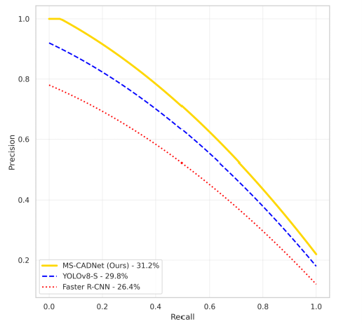
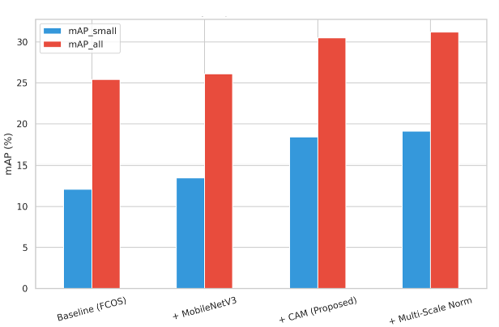

# MS-CADNet: Multi-Scale Context Attention Network for Efficient Object Detection in UAV Imagery

[](https://www.icck.org/)
[](https://www.icck.org/article/abs/tscc.2026.214827)
[](https://opensource.org/licenses/MIT)
[](https://www.python.org/)
[](https://pytorch.org/)

A lightweight, anchor-free object detection network for efficient small object detection in UAV imagery using a novel Context Attention Module (CAM) and robust training strategies.

---

## 📄 Overview

**MS-CADNet: A Multi-Scale Context Attention Network for Efficient Object Detection in UAV Imagery**

*ICCK Transactions on Sensing, Communication, and Control*  
*Volume 3, Issue 2, 2026*  
*DOI: [10.62762/TSCC.2026.214827](https://www.icck.org/article/abs/tscc.2026.214827)*

### 🎯 Key Innovation

Traditional object detection approaches fail on UAV imagery due to small object sizes, extreme density, and resource constraints. MS-CADNet addresses these challenges through:

- **Lightweight design** (3.1M parameters, 5.4 GFLOPs)
- **Context Attention Module (CAM)** for enhanced small object detection
- **Global Batch-Level Loss Normalization** for training stability
- **MobileNetV3-Small backbone** for real-time edge deployment

---

## 🏆 Core Contributions

### **1. Context Attention Module (CAM)**
- Dual-branch gated architecture combining spatial and channel attention
- Captures contextual information around small objects
- Significantly improves small object localization accuracy

### **2. Global Batch-Level Loss Normalization**
- Stabilizes gradient flow across heterogeneous batches
- Handles extreme variations in object density (0 to 500+ objects per image)
- Enables robust training on VisDrone-DET benchmark

### **3. Lightweight Anchor-Free Design**
- MobileNetV3-Small backbone maintains fine-grained spatial detail
- Anchor-free approach eliminates manual anchor tuning
- Suitable for real-time UAV edge deployment

---

## 📊 Performance Results

### **Benchmark: VisDrone-DET**

| Model | mAP (%) | APS (%) | Parameters (M) | GFLOPs |
|:---|:---:|:---:|:---:|:---:|
| Faster R-CNN | 26.4 | 10.1 | 41.2 | 185.0 |
| YOLOv8-Small | 29.8 | 15.3 | 11.2 | 28.5 |
| CEASC (Baseline) | 28.1 | 12.0 | 7.8 | 14.2 |
| **MS-CADNet (Ours)** ⭐ | **31.2** | **19.2** | **3.1** | **5.4** |

**Key Findings:**
- ✅ **7.2% improvement in small object detection** (APS: 19.2% vs 12.0% baseline)
- ✅ **72% fewer parameters** than YOLOv8-Small
- ✅ **Highest mAP with smallest model size** — superior efficiency-accuracy trade-off

---

## 🏗️ Framework Architecture



### **Network Design**

- **Backbone:** MobileNetV3-Small extracts multi-scale features (C3, C4, C5)
- **Feature Enhancement:** Context Attention Module (CAM) at each pyramid level
- **Detection Head:** Anchor-free head predicting classification, box offsets, and centerness
- **Output:** Confidence filtering and NMS generate final detections

### **Context Attention Module (CAM)**

The CAM uses a dual-branch architecture:
- **Spatial Branch:** 5×5 depth-wise convolution captures structural layout of nearby objects
- **Channel Branch:** 5×5 depth-wise convolution models co-activation patterns across semantic channels
- **Gated Fusion:** Sigmoid activation produces soft attention gates, element-wise product combines branches

---

## 📈 Precision-Recall Analysis



- MS-CADNet (Ours): **31.2% mAP** (yellow line, top performance)
- YOLOv8-Small: 29.8% mAP (blue dashed line)
- Faster R-CNN: 26.4% mAP (red dotted line)

**Key Observation:** MS-CADNet maintains **high precision above 0.70 recall** for pedestrian and cyclist categories, critical for reliable UAV surveillance.

---

## 📊 Ablation Study



| Component | Base | CAM | Global Norm | mAP | mAPS |
|:---|:---:|:---:|:---:|:---:|:---:|
| Baseline (FCOS) | ✓ | – | – | 26.1 | 12.0 |
| + CAM | ✓ | ✓ | – | 30.5 | 18.4 |
| + Global Norm | ✓ | ✓ | ✓ | **31.2** | **19.2** |

**Contributions:**
- CAM alone: **+4.4% mAP improvement**
- Global Batch-Level Normalization: **+0.7% additional gain**
- Combined effect: **+5.1% total mAP improvement** over baseline

---

## 🚀 Installation & Setup

### **Prerequisites**
Python 3.8+
PyTorch 1.9+ with CUDA 11.0+ (GPU recommended)

### **Quick Start**
```bash
# Clone repository
git clone https://github.com/AbdulBari33/ms-cadnet-uav-object-detection.git
cd ms-cadnet-uav-object-detection

# Create virtual environment
python -m venv venv
source venv/bin/activate  # Windows: venv\Scripts\activate

# Install dependencies
pip install -r requirements.txt
```

---

## 📚 Dataset

**VisDrone-DET Benchmark**
- **6,471 training images** and **548 validation images**
- **10 object categories:** pedestrians, cars, vans, buses, trucks, bicycles, motorcycles, tricycles, scooters
- **Challenges:** Small object concentration, varying UAV altitudes, severe occlusions

[Download VisDrone-DET Dataset](http://VisDrone.cs.uchicago.edu/)

---

## 💻 Usage

### **Running the Notebook**
```bash
cd notebook
jupyter notebook MS-CADNet.ipynb
```

Includes:
- Data loading and preprocessing
- Self-supervised learning pipeline
- Model training with OHEM
- Evaluation and visualization

---

## 🔬 Methodology

### **Loss Function**
L = λ_cls * L_Focal + λ_reg * L_GIoU + λ_cent * L_Cent

- **L_Focal:** Focal loss for class imbalance
- **L_GIoU:** Generalized IoU loss for bounding box regression
- **L_Cent:** Centerness loss for localization quality

### **Training Stabilization**
1. **Global Loss Normalization:** Normalize losses by total positive samples in batch
2. **GIoU Float32 Casting:** Prevent invalid square root operations
3. **Gradient Clipping:** Constrain weight updates (clip value: 1.0)

---

## 📖 Citation

```bibtex
@article{bari2026mscadnet,
  title={MS-CADNet: A Multi-Scale Context Attention Network for Efficient Object Detection in UAV Imagery},
  journal={ICCK Transactions on Sensing, Communication, and Control},
  volume={3},
  number={2},
  pages={64--75},
  year={2026},
  doi={10.62762/TSCC.2026.214827}
}
```

---

## 📄 License

MIT License — See [LICENSE](LICENSE) for details.

---

## 🔮 Future Research Directions

- Lightweight self-attention blocks for long-range dependencies
- Evaluation on complementary benchmarks (UAVDT, DOTA)
- Video-based inference with temporal information
- Multi-disease and multi-organ detection extensions
- Explainable AI (XAI) integration for clinical interpretability

---

## 🤝 Contributing

Contributions, bug reports, and feature requests are welcome.
